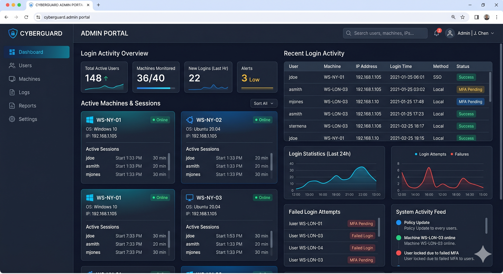

<div align="center">

# Login Report System

Modern Flask-based dashboard for monitoring active user sessions across company machines.



</div>

---

# Overview

Login Report System is a lightweight monitoring platform designed to process login and logout events and display active user sessions in real time.

The application reads chronological event data, analyzes machine activity, and generates a clean dashboard interface showing connected users by workstation.

This project was developed using professional Flask architecture patterns and modular backend organization practices.

---

# Dashboard Features

- Active session tracking
- Login/logout event processing
- Machine-based monitoring
- Dynamic Flask rendering
- Responsive dashboard UI
- Modular backend architecture
- External JSON data source
- Professional project structure

---

# Tech Stack

| Backend | Frontend | Tools |
|---|---|---|
| Python | HTML5 | Git |
| Flask | CSS3 | GitHub |
| Jinja2 | Responsive Layout | Virtual Environment |

---

# Project Architecture

```bash
login-report-system/
│
├── app/
│   ├── __init__.py
│   ├── routes.py
│   │
│   ├── services/
│   │   └── report_service.py
│   │
│   ├── templates/
│   │   ├── base.html
│   │   └── index.html
│   │
│   └── static/
│       └── css/
│           └── style.css
│
├── data/
│   └── events.json
│
├── docs/
│   └── dashboard-preview.png
│
├── tests/
│
├── run.py
├── requirements.txt
└── README.md
```

---

# Application Preview

The dashboard dynamically displays:

- Active users
- Connected machines
- Current session state
- Machine activity cards

Each machine is rendered dynamically using Jinja2 templates and Flask routing.

---

# Installation

Clone repository:

```bash
git clone https://github.com/YOUR_USERNAME/login-report-system.git
```

Move into project:

```bash
cd login-report-system
```

Create virtual environment:

```bash
python -m venv venv
```

Activate virtual environment:

### Windows

```bash
venv\Scripts\activate
```

Install dependencies:

```bash
pip install -r requirements.txt
```

---

# Run Application

```bash
python run.py
```

Open browser:

```text
http://127.0.0.1:5000
```

---

# Event Processing Logic

The system processes events chronologically to ensure accurate active session tracking.

Supported event types:

- login
- logout

The backend updates machine session states dynamically and renders results directly to the dashboard interface.

---

# Future Roadmap

- SQLite integration
- SQLAlchemy ORM
- REST API
- Authentication system
- Event management panel
- Search and filtering
- Docker support
- Automated testing
- CI/CD workflows

---

# Development Notes

This project was built as part of a professional Python and Flask backend development learning process, with emphasis on:

- clean architecture
- modular backend organization
- scalable Flask structure
- professional Git workflow

---

<div align="center">

Developed by Camilo Melo

</div>